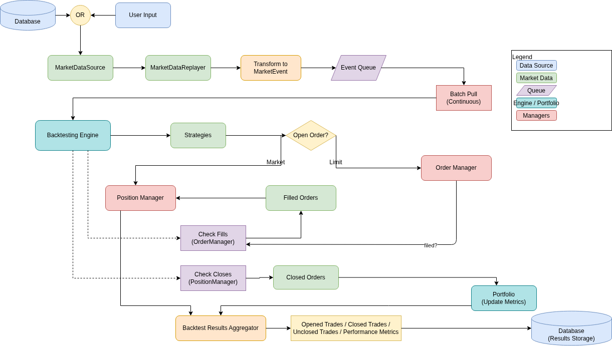

# Trading Engine Backtesting System

A deterministic, single-threaded backtesting engine for trading strategy simulation. Built with zero external dependencies and designed for correctness, clarity, and reproducibility.

## Overview

This engine is a **simulation kernel**—not an application. It prioritizes determinism, testability, and clear separation of responsibilities over convenience. Every backtest run produces identical results given the same inputs.



## Features

- **Deterministic Execution** — No wall-clock time, no randomness without fixed seeds
- **Event-Driven Architecture** — Priority queue with timestamp-based ordering
- **Zero Dependencies** — Pure Python, no external libraries required
- **Immutable Events** — All events are frozen dataclasses with type safety
- **Read-Only Market Replay** — Validates ordering, never mutates engine state
- **Passive Strategies** — React to events, emit intents not actions
- **Comprehensive Logging** — State transitions logged, data streams excluded
- **100% Test Coverage** — Every component unit tested with invariant checks

## Quick Start

### Installation

No installation required! The engine is pure Python with zero dependencies. Just clone and run:

```bash
git clone <your-repo>
cd trading-engine
```

### Basic Usage

```python
from core import Engine
from market_data import MarketDataReplayer, CSVMarketDataSource
from strategies.dca import DCA

# Initialize engine with initial capital
engine = Engine(initial_cash=100000)

# Add your strategy
engine.add_strategy(DCA(buyframe=10, buy_amount=20))

# Load market data
replayer = MarketDataReplayer()
replayer.set_market_data_source(CSVMarketDataSource(path="data.csv"))

# Run backtest
replayer.replay(engine=engine, chunked=True)
```

### Command Line Interface

The engine includes a CLI for running backtests from CSV files:

```bash
python main.py csv --path data.csv --cash 100000
```

#### CLI Options

| Command | Description |
|---------|-------------|
| `csv --path <file>` | Run backtest from CSV file |
| `db --host --port` | Use database source (future) |
| `-c, --cash` | Initial trading capital |
| `--profile-memory` | Enable memory profiling |

## Project Structure

```
core/               # Engine control flow, event dispatch, time management
├── engine.py       # Main Engine class (control flow owner)
├── event_queue.py  # Priority queue with timestamp ordering
├── clock.py        # Deterministic time management
├── dispatcher.py   # Event dispatcher and routing
└── handlers/       # Strategy, order, position management

events/             # Immutable event definitions and payloads
├── events.py       # Event type definitions
└── payloads.py     # Typed event payloads

market_data/        # Data ingestion and replay (read-only)
├── replayer.py     # MarketDataReplayer (orchestrates replay)
└── sources.py      # CSVMarketDataSource, DB sources (future)

strategies/         # Strategy base classes and implementations
├── base.py         # Strategy ABC, Signal types
└── dca.py          # Dollar Cost Average example strategy

common/             # Shared types, enums, and utilities
└── types.py        # Custom types, enums, TypedDicts
```

## Architecture Deep Dive

### Dependency Direction

Dependencies flow in one direction only:

```
Market Data → Event → Event Queue → Engine → Strategy → Order Manager → Position Manager → Portfolio → Metrics
```

### Engine Core (`core/engine.py`)

The `Engine` class owns control flow and manages all subsystems:

```python
class Engine:
    __slots__ = (
        "_queue",           # Event priority queue
        "_clock",           # Deterministic clock
        "_strategy_handler",# Manages strategy instances
        "_portfolio",       # Tracks trades and metrics
        "_orderManager",    # Handles order submission/fills
        "_positionManager", # Manages open positions
        "_event_dispatcher",# Routes events to handlers
        "_initial_cash",    # Starting capital
    )
```

**Key methods:**
- `push_event(event)` — External events enter here
- `run()` — Main loop: pop → advance clock → dispatch → run strategies
- `add_strategy(strategy)` — Register trading strategies
- `reset()` — Reset engine to initial state

**Engine invariants:**
- Only the engine advances time and dispatches events
- Handlers return actions; engine enqueues them
- Engine never creates events except synthetic ones (TIMER, ORDER_FILL)
- Exceptions are never swallowed — they indicate invalid state

### Event Queue (`core/event_queue.py`)

Priority queue with deterministic ordering:

```python
# Ordering key: (timestamp, sequence_number)
# FIFO queues are forbidden — only priority queue allowed
# Queue underflow is an error (raises exception)
```

### Market Data Replay (`market_data/replayer.py`)

Read-only replay that validates ordering:

```python
replayer = MarketDataReplayer()
replayer.set_market_data_source(CSVMarketDataSource(path="data.csv"))
replayer.replay(engine=engine, chunked=True)
```

**Rules:**
- Replayer does not mutate engine state directly
- Out-of-order data raises exceptions
- Timestamps pass through untouched
- One responsibility: data → events

### Strategy System (`strategies/`)

Strategies are **passive** — they react to events, never control time:

```python
class DCA(Strategy):
    def __init__(self, buyframe: int, buy_amount: float):
        self._buyframe = buyframe
        self._buy_amount = buy_amount
        self._counter = 0

    def on_event(self, event: MarketDataEvent) -> list[Signal]:
        # Emit signals (intents), not direct orders
        if self._counter % self._buyframe == 0:
            return [OrderSignal(
                symbol=event.payload.symbol,
                quantity=self._buy_amount / event.payload.price,
                signal_type=SignalType.BUY
            )]
        return []
```

**Strategy rules:**
- No I/O inside strategies (no file access, network, DB)
- Strategies emit intents (`OrderSignal`, `CloseSignal`), not actions
- No wall-clock time or random number generation without fixed seeds

### Order & Position Management

The engine processes signals through a clean pipeline:

```
Strategy Signal → OrderManager → OrderFill → PositionManager → Portfolio
```

**Order flow:**
1. Strategy emits `OrderSignal` (intent)
2. `OrderManager` creates and tracks orders
3. On market data event, orders fill at current price
4. `PositionManager` tracks open positions
5. On close signal, positions close and go to `Portfolio`

**Close signal modes:**
- `order_id` set → Close specific fill (TP/SL path)
- `order_id` None → FIFO close with quantity/fraction support

## Event System

All events are immutable and carry explicit timestamps:

```python
@dataclass(frozen=True, slots=True)
class MarketDataEvent(Event):
    timestamp: int
    payload: MarketDataPayload

@dataclass(frozen=True, slots=True)
class OrderFillEvent(Event):
    timestamp: int
    payload: OrderFillPayload
```

**Design rules:**
- `frozen` ensures immutability
- `slots` optimizes memory and attribute access
- No logic inside events — data only
- Typed payloads (dataclasses or `TypedDict`)

## Determinism Guarantees

| Rule | Enforcement |
|------|------------|
| No wall-clock time | `datetime.now()` and `time.time()` forbidden in engine |
| Explicit timestamps | All events carry timestamp from data source |
| Stable ordering | `(timestamp, sequence_number)` for equal timestamps |
| Fail-fast | Invariant violations raise exceptions (no silent correction) |
| Seeded randomness | Tests use fixed seeds; production uses no randomness |

## Logging

Use the engine logger exclusively:

```python
import logging
log = logging.getLogger("engine")

log.info("engine setup successfully")
log.debug("Dispatching event: type=%s ts=%d", event, event.timestamp)
```

**Logging rules:**
- Log state transitions, not data streams
- No logging in tight loops unless `DEBUG`-guarded
- No `print()` statements
- Payload contents not logged by default

## Prohibited Patterns

The following are **forbidden** inside engine code:

| Pattern | Reason |
|---------|--------|
| `datetime.now()`, `time.time()` | Breaks determinism |
| `time.sleep()` | Threading not supported |
| Threads or async | Single-threaded only |
| Global variables | Breaks state isolation |
| Silent error handling (`except: pass`) | Hides invariant violations |
| Side effects in constructors | Unpredictable initialization |
| FIFO queues | Priority queue required for deterministic ordering |

## Type Safety & Code Quality

**Best practices:**
- Use `Literal` or `Enum`, not magic strings
- Use `TypedDict` for fixed-structure dictionaries
- Use `NamedTuple` for fixed-structure tuples
- Use `StrEnum`/`IntEnum` for related constants requiring runtime checking
- Prefer composition over inheritance
- Maximum nesting depth of 3 — break down deeper functions

## Example: Running a Backtest

### 1. Prepare CSV data

```csv
timestamp,symbol,price,volume
1640995200,BTCUSDT,45000.0,1.5
1640995260,BTCUSDT,45100.0,2.0
1640995320,BTCUSDT,44950.0,1.8
```

### 2. Run with CLI

```bash
python main.py csv --path market_data.csv --cash 100000
```

### 3. Or use programmatically

```python
from core import Engine
from market_data import MarketDataReplayer, CSVMarketDataSource
from strategies.dca import DCA

# Setup
engine = Engine(initial_cash=100000)
engine.add_strategy(DCA(buyframe=10, buy_amount=100))

# Load and replay
replayer = MarketDataReplayer()
replayer.set_market_data_source(CSVMarketDataSource(path="market_data.csv"))
replayer.replay(engine=engine, chunked=True)

# Results are logged automatically
# Access metrics via engine._portfolio.get_trading_metrics()
```

## Future Extensions

The architecture supports easy extensions:

- **Database sources** — Implement `MarketDataSource` for PostgreSQL, Redis, etc.
- **Live trading** — Wrap engine in adapter that feeds real-time data
- **Distributed backtesting** — Engine remains single-threaded; parallelize at strategy level
- **Alternative strategies** — Implement `Strategy` ABC with `on_event()` method

## Final Note

This engine is a **simulation kernel**, not an application. Correctness, clarity, and determinism take priority over convenience. Every design decision serves these goals.