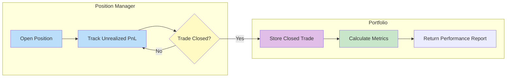

### Event Queue

- all the event go into this queue, and then everything is handle using a handler
- Priority Queue with `timestamp`
- this is a deterministic backtesting queue, so no threading / other things like async programming needed

### Engine

- the main backtesting loop run here
- Handle Event mapping, time checking, etc

### Clock
- internal clock used to generate timestamp
- internal timing logic
- Used to mangage the order of event
> Note that this Clock is logical time, not the wall-clock time

### Event
- Event are all dataclass with timestamp and a payload
- The payload structure will depends on the even given.

### Portfolio

### PositionManager
- used to manage mutliple position for different stock (identify by their symbol)
- Handle filling of position

### OrderManager
- used to manage unfilled Order (in the pending state)
- if the order is filled, the order will be redirected to the Position Manager

